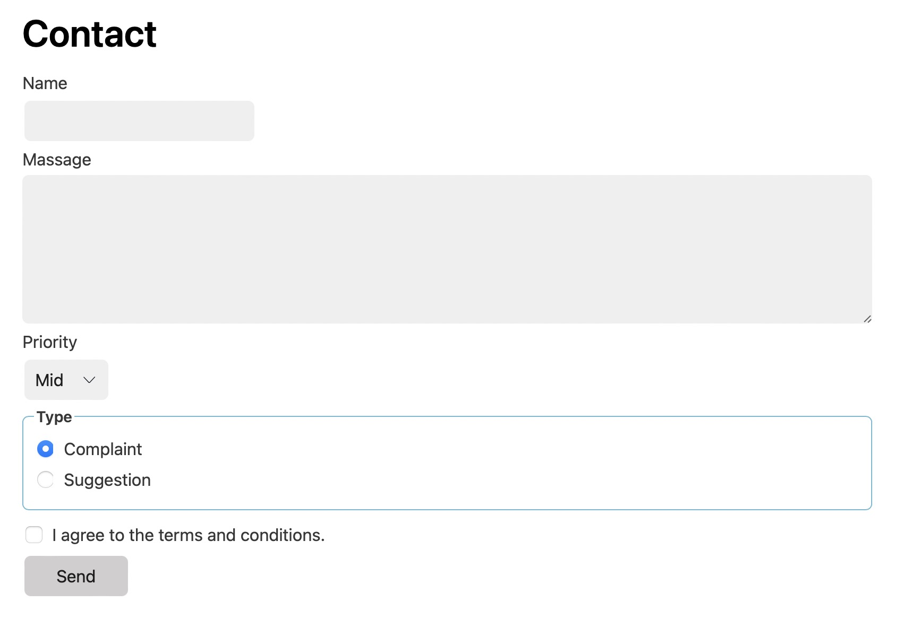

# Koala_LAB
## Front-end Project
### Program 1
In the first week, you should learn about html, php development. A very great tutorial is in the following url. You should follow it to create your website and collect information. The knowledge you may need: HTML language, PHP language, MySQL language. You also need to install MySQL environment and PHP environment in your computer.

The deadline for this assginment is Oct 23 (Two Weeks)! In the first week, I hope that you can finish building environment and make a simple website like that.

Use PHP to save HTML form into MySQL database: https://b23.tv/cNoxVRo

### Program 2

The second program is about a login program. In this program, you need to design a website to login\logout\register. Use Mysql to save the user's infomation. The deadline for this program is November 11th.(about 3 weeks)

In this program, I suggest you to use Bootsrtrap to design a more beautiful website. The address for it is https://getbootstrap.com/docs/5.2/getting-started/introduction/